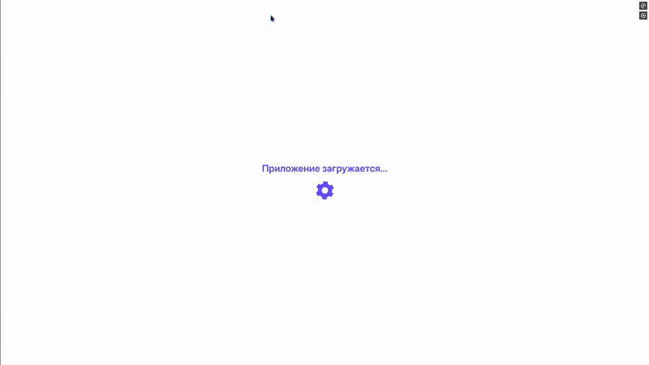
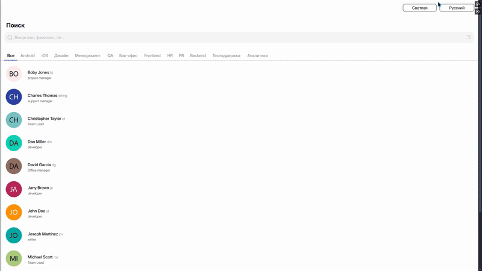
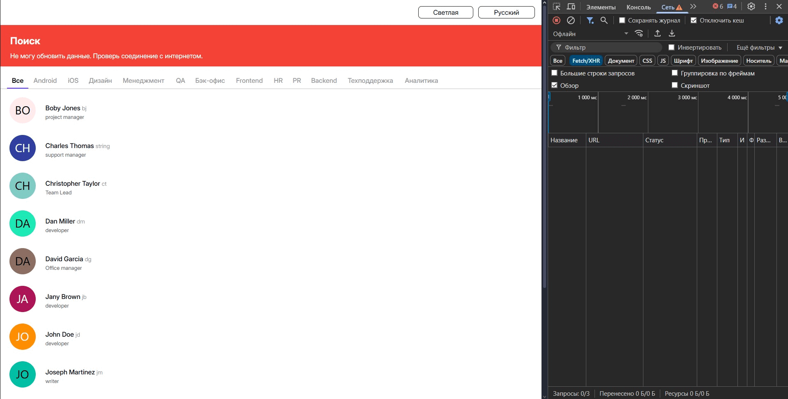

# Staff portal

**О проекте:** Проект создан в учебных целях для отработки навыков разработки веб-приложений. Представляет собой веб-приложение для загрузки и просмотра списка сотрудников с возможностью фильтрации и сортировки. Дополнительный функционал: локализация, выбор темы приложения и отслеживание состояния сети.

## Технологии

- CSS3/HTML5
- Typescript
- React
- React Router Dom (v7)
- Redux Toolkit
- Axios
- i18next (Локализация)
- Vite (Сборщик)
- ESLint (Линтер)

## Использование

### Требования

Для установки и запуска проекта, необходим NodeJS v18+.

### Установка зависимостей

Для установки зависимостей, выполните команду:

```bash
npm i
```

### Запуск Development сервера

Чтобы запустить сервер для разработки, выполните команду:

```
npm start
```

### Сборка проекта

Чтобы собрать проект выполните команду:

```
npm run build
```

## Демонстрация работы

<details>
<summary><b>Развернуть<b></summary></br>

|  |
| :--------------------------------------------: |
|        _Основной функционал приложения_        |

|  |
| :--------------------------------------------: |
|        _Основной функционал приложения_        |

|  |
| :-------------------------------------------------------------------------------------: |
|                          _Локализация, смена темы приложения_                           |

|  |
| :----------------------------------------------: |
|          _Отслеживание состояния сети_           |


</details>
